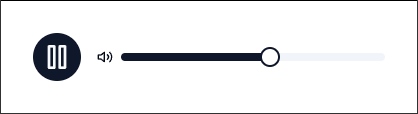

# noigen

This app, built using the [Wails framework](https://wails.io/), generates and controls brown noise, a type of audio signal with a specific frequency spectrum. It provides functionalities such as starting/stopping playback, muting/unmuting, and adjusting volume, all within a simple GUI.

## Build

Before building the application, ensure you have Go 1.20 or higher and Node.js 15 or higher installed on your system. For detailed installation instructions, please refer to the [Wails installation guide](https://wails.io/docs/gettingstarted/installation).

1. **Install Wails CLI**:

   ```sh
   go install github.com/wailsapp/wails/v2/cmd/wails@latest
   ```

2. **Build the application**:

   ```sh
   wails build
   ```

   After running `wails build`, the executable will be created in the `build/bin` directory of the project. The specific filename depends on the platform. For example, on Windows, the file will be `build\bin\noigen.exe`.

## Usage

### Starting the Application

To start the application, run the executable. The application window will open, displaying the controls for generating and managing brown noise.

### Controls



- **Play/Pause**: Use the play/pause button to start or stop the noise playback.
- **Mute/Unmute**: Use the mute/unmute button to mute or unmute the audio.
- **Volume**: Adjust the volume slider to increase or decrease the volume of the noise.

### Command Line Options

The application does not currently support command line options.

## Troubleshooting

If you encounter any issues, ensure that your audio output device is configured correctly and not muted.

For further assistance, please refer to the [Wails framework documentation](https://wails.io/docs/) or open an issue on the project's repository.

## Contributing

If you would like to contribute to the development of this app, please follow these steps:

1. Fork the repository.
1. Create a new branch for your feature or bugfix.
1. Make your changes and commit them with a descriptive message.
1. Push your changes to your fork.
1. Open a pull request to the main repository.

## License

This project is licensed under the MIT License. See the [LICENSE file](LICENSE) for more details.